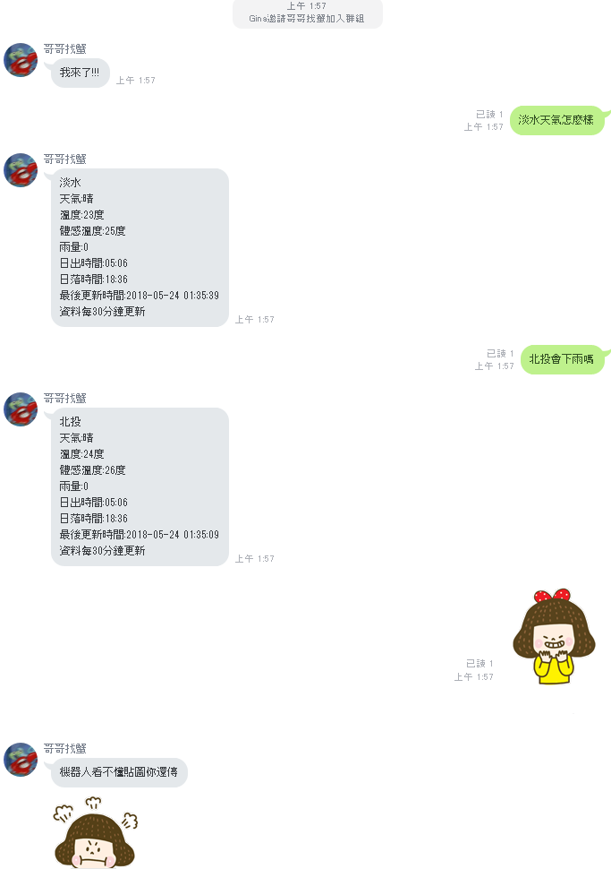

# Line Chat Bot with C#

## 使用isRock光岩科技提供的LineBotSDK套件所製作

## 搭配了Microsoft提供的LUIS服務

## 佈署到Microsoft提供的Azure服務，因為使用Line的這個服務必須要支援HTTPS服務

## 當你對機器人說天氣如何之類的話語，他就會回報天氣狀況

## 天氣資訊使用中央氣象局的開放資料

[Demo影片](<https://drive.google.com/file/d/1c1rw5Vwah1-FAfKCu6LL96TlloRO304R/view>)

